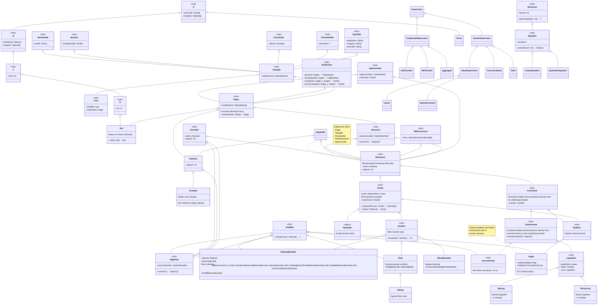

### Algebra

The following diagram shows the type hierarchy in the algebra module.

```mermaid
classDiagram
    %% Top-level types
    class Renderable {
        <<trait>>
        +render: String
    }
    
    class Numeric {
        <<trait>>
        +maybeDouble: Double
    }
    
    class Exactitude {
        <<trait>>
        +isExact: Boolean
    }
    
    class Normalizable {
        <<trait>>
        +normalize: T
    }
    
    class TypeSafe {
        <<trait>>
        +typeName: String
        +category: String
        +describe: String
    }
    
    class Valuable {
        <<trait>>
        +maybeFactor: Option[Factor]
    }

    class Lazy {
        <<trait>>
        +simplify: Lazy
        +materialize: Eager
    }
    
    class DyadicOps {
        <<trait>>
        +eqv(that: Eager): Try[Boolean]
        +fuzzyEqv(that: Eager): Try[Boolean]
        +compare(x: Eager, y: Eager): Try[Int]
        +fuzzyCompare(x: Eager, y: Eager): Try[Int]
    }
    
    class Approximate {
        <<trait>>
        +approximation: Option[Real]
        +toDouble: Double
    }
    
    class R {
        <<trait>>
        +asDouble: Double
        +maybeQ: Option[Q]
    }
    
    class Q {
        <<trait>>
        +toRational: Rational
        +maybeZ: Option[Z]
    }
    
    class Z {
        <<trait>>
        +toInt: Int
    }

    class N {
        <<trait>>
        +inc: N
    }

    %% All eager values
    class Eager {
        Concrete values (not lazy)
        <<trait>>
        +maybeName: Option[String]
        +named(name: String): Eager
    }
    
    %% Complex (outside Structure)
    class Complex {
        Wraps core.Complex
        NO Order (not totally ordered)
    }
    
    %% Nat (outside Structure)
    class Nat {
        Based on Peano arithmetic
        ++(that: Nat): Nat
    }
    
    class Structure {
        <<trait>>
        +convert(T): Option[T]
        +asJavaNumber: Option[Number]
    }
    
    class Zeroable {
        <<trait>>
        +isZero: Boolean
        +signum: Int
    }
    
    class Scalable {
        <<trait>>
        +*(scaleFactor: Rational): T
    }
    
    class Branched {
        <<trait>>
        +branch: Int
        +branched(index: Int): T
    }
    
    class WithFuzziness {
        <<trait>>
        +fuzz: Option[Fuzziness[Double]]
    }
    
    class Equation {    
        <<trait>>
        +solve(branch: Int): Solution
        +transform
    }
    
    class Algebraic {
        <<trait>>
        +convert(T): Option[T]
        +asJavaNumber: Option[Number]
    }
    
    class Monotone {
        <<trait>>
        Monotonically increasing with value
        +isZero: Boolean
        +signum: Int
    }
    
    class Functional {
        <<trait>>
        Monotonic entities whose behavior derives from
         an underlying Number
        +number: Number
    }
    
    class Transformed {
        <<trait>>
        Functional entities whose behavior derives from
         a transformation on the underlying Number
        +transformation[T]: Option[T]
    }
    
    class Solution {
        +signum: Int
    }
    
    class Scalar {
        <<trait>>
        Linear relationship to value
        Dimensionless quantity
        +compareExact(x: Scalar): Option[Int]
        +scaleFactor: Double
        +scale(r: Rational): Scalar
    }
    
    class Number {
        <<trait>>
        Main numeric type
        +compare(x: Number): Int
    }
    
    class RationalNumber {
        +rational: Rational
        +percentage flag
        Exact rationals
        Additional mixins: Q with CanAddAndSubtract[RationalNumber, RationalNumber] with CanMultiplyAndDivide[RationalNumber] with Scalable[RationalNumber] with CanPower[RationalNumber]
        +Field[RationalNumber]
    }
    
    class Real {
        Fuzzy/uncertain numbers
        +Ring[Real] with Ordering[Real]
    }
    
    class WholeNumber {
        Integers/naturals
        +CommutativeRing[WholeNumber]
    }
    
    class Infinity {
        Special Real case
    }
    
    class InversePower {
        <<trait>>
        Non-linear monotone: x^(-n)
    }
    
    %% Angular measures
    class Radians {
        <<trait>>
        Angular measurements
    }
    
    class Angle {
        +radians/degrees flag
        +AdditiveCommutativeGroup
        NO Order (circular)
    }
    
    %% Transformed (other Monotones)
    class Logarithm {
        <<trait>>
        Logarithmic values
        +base: Number
        +unit: Logarithm
    }
    
    class NatLog {
        Natural logarithm
        +x: Number
    }
    
    class BinaryLog {
        Binary logarithm
        +x: Number
    }
    
    %% Sentinel
    class NoScalar {
        <<object>>
        Empty/sentinel value
    }
    
    %% Inheritance relationships
    Renderable <|-- Valuable
    Numeric <|-- Valuable
    Exactitude <|-- Valuable
    Normalizable <|-- Valuable
    TypeSafe <|-- Valuable
    
    Approximate <|-- Eager
    DyadicOps <|-- Eager
    Valuable <|-- Eager
    Valuable <|-- Lazy
    
    R <|-- Q
    Z <|-- N
    Q <|-- Z
    R <|-- Circle
    
    Scalable <|-- Angle
    Scalable <|-- Algebraic
    Scalable <|-- InversePower
    Scalable <|-- RationalNumber
    Scalable <|-- Real
    Zeroable <|-- Algebraic
    Zeroable <|-- Monotone
    Structure <|-- Monotone
    Negatable <|-- Monotone
    WithFuzziness <|-- Monotone
    Eager <|-- Solution
    Negatable <|-- Solution
    N <|-- Nat
    Eager <|-- Nat
    Eager <|-- Structure
    
    Solution <|-- Complex
    Solution <|-- Algebraic
    Zeroable <|-- Algebraic
    Scalable <|-- Algebraic
    
    Expression <|-- CompositeExpression
    Expression <|-- AtomicExpression
    
    CompositeExpression <|-- UniFunction
    CompositeExpression <|-- BiFUnction
    CompositeExpression <|-- Aggregate
    
    AtomicExpression <|--ValueExpression
    AtomicExpression <|--Transcendental
    AtomicExpression <|--Root
    
    ValueExpression <|-- Literal
    ValueExpression <|-- NamedConstant
    
    Approximate <|-- Monotone
    
    %% Structure subtypes
    Structure <|-- Monotone
    
    %% Monotone subtypes
    Monotone <|-- Scalar
    Monotone <|-- Functional
    
    %% Functional subtypes
    Functional <|-- Transformed
    Functional <|-- Radians
    
    %% Scalar subtypes
    Scalar <|-- Number
    Scalar <|-- Radians
    Scalar <|-- NoScalar
    
    %% Number subtypes
    Number <|-- RationalNumber
    Number <|-- Real
    Number <|-- WholeNumber
    
    %% Real specialization
    Real <|-- Infinity
    
    %% Radians specialization
    Radians <|-- Angle
    
    %% Transformed subtypes
    Transformed <|-- Logarithm
    Transformed <|-- InversePower
    Logarithm <|-- NatLog   
    Logarithm <|-- BinaryLog   

    %% Branched subtypes
    Branched <|-- Equation
    Equation <|-- LinearEquation
    Equation <|-- QuadraticEquation
    
    %% Notes about key types
    note for Angle "Extends Radians but breaks<br/>monotonicity due to<br/>circular structure"
    
    note for Monotone "Implements traits:<br/>- Eager<br/>- Valuable<br/>- Renderable<br/>- MaybeNumeric<br/>- Approximate"
```
